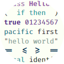
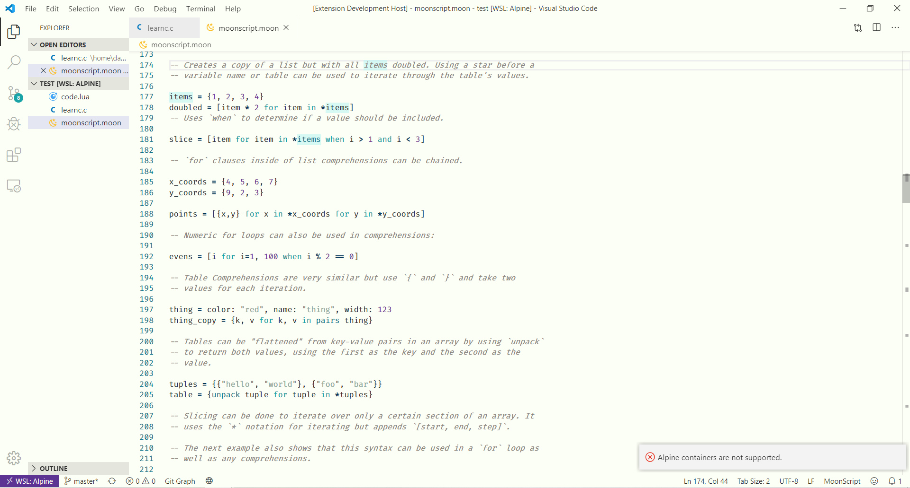

  

<h1 align="center">Pacific First</h1>

   
  

  A light theme that actually looks decent for VSCode.

## Why?

Well, simply put, I personally believe that most VSCode Light themes are not good. At all. They all looked like the same theme but with slightly different tones, or just straight up unreadable or with no sense of style at all.

This is sort of an attempt to put together a light colorscheme I like (which is included in `assets/pacific.sass`), made by just combining several scales from Adobe Color. How original, I know. I quite like the result and I think it's actually readable and presentable.

Pacific was going to be the name for the colorscheme, but since this is the first iteration, and put together too quickly, I figure it it totally going to change in the future, so I'm calling this Pacific First.

And yes, I went through all the hassle of registering myself as a publisher for this.

## Installing

You can install it through the VSCode Marketplace. Otherwise get the .vsix file from the releases and do `code --install-extension pacific-first-VERSION.vsix`.

## License

There's no license to this project. All public domain.

## Maintainer

Me, probably.  
Dael Muñiz ([daelvn@gmail.com](mailto:daelvn@gmail.com))